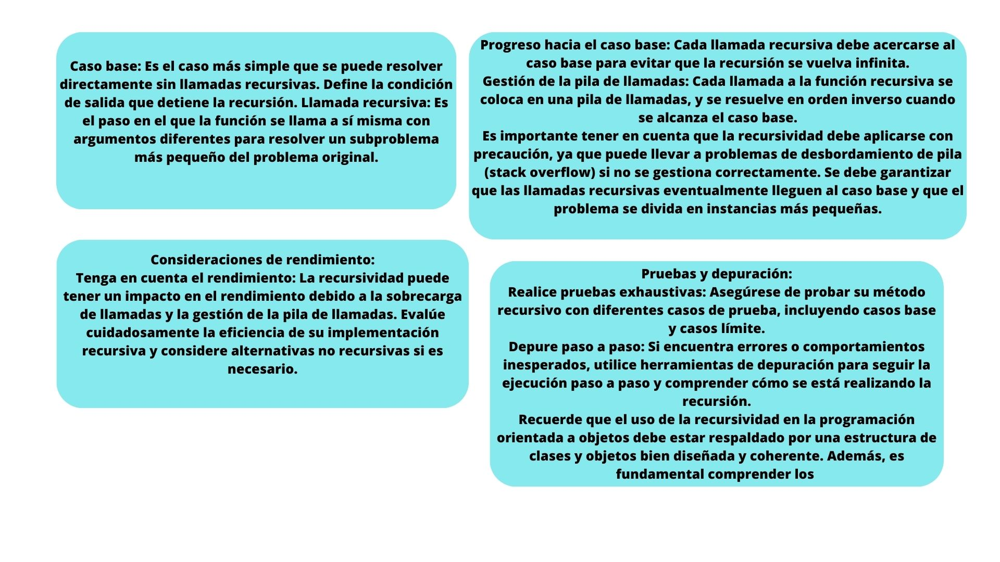

--- 
```
class FactorialCalculator {
    constructor(number) {
        this.numberToCalculate = number;
    }

    calculateFactorial() {
        // Caso base: Cuando el número es igual a 0 o 1, el factorial es 1.
        if (this.numberToCalculate === 0 || this.numberToCalculate === 1) {
            return 1;
        } else {
            // Caso recursivo: Llama a calculateFactorial con un número más pequeño.
            const smallerCalculator = new FactorialCalculator(this.numberToCalculate - 1);
            const smallerFactorial = smallerCalculator.calculateFactorial();
            return this.numberToCalculate * smallerFactorial;
        }
    }
}

const n = 5; // Número para calcular el factorial
const calculator = new FactorialCalculator(n);
const factorial = calculator.calculateFactorial();
console.log(`El factorial de ${n} es ${factorial}`);

 ```